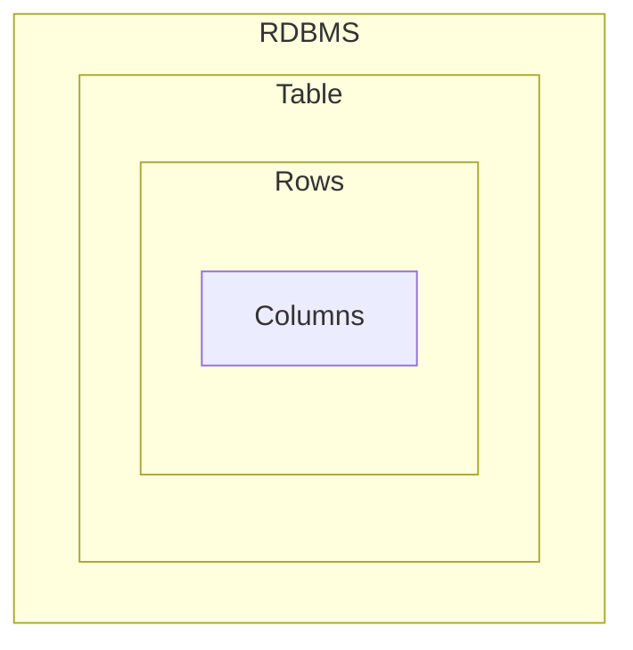
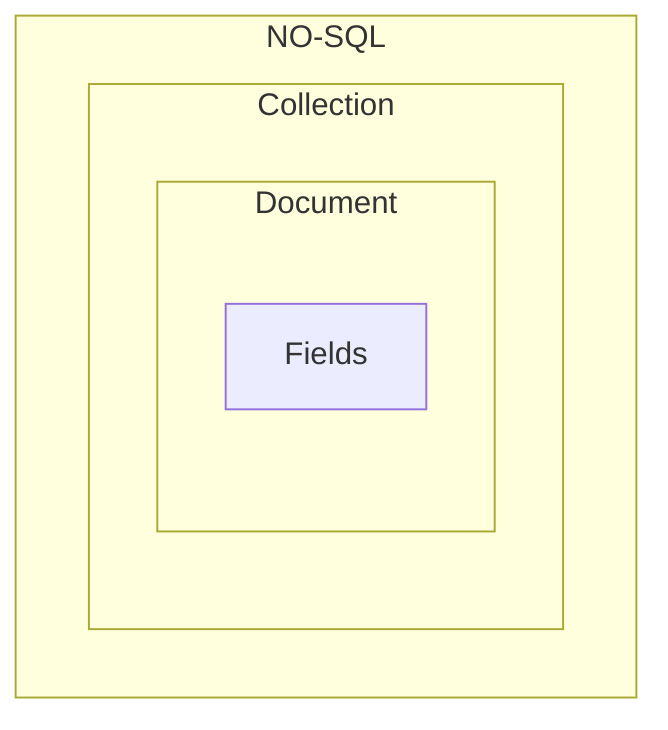

#<p style="color: #f00; text-align: center;"> Be a Mongoose Master</p>

## What is mongoDB ?

-  MongoDB is an NO-SQL Database, Which store JSON like documents.
-  Mongo Stores data like `BSON Format`.
-  No-SQL databases break from relational models, ideal for managing vast data.
-  MongoDB stands out for it's `scalability`, `flexibility` and `performance`
   trusted by giants like Facebook , Google, EBay.
-  MongoDB is Developed By `MongoDB Inc`

## Why we use `MongoDB` ?

-  Highly Scalable, High-performance and Open-source.
-  Document Oriented Database
-  Cost Effective Solutions.
-  Rich Ecosystem of Tools, Documents and community.

## What is the different between MongoDB & Relational Database.

|  Features   |                 MongoDB                 | Relational Database |
| :---------: | :-------------------------------------: | :-----------------: |
| Data Model  |            Document Oriented            |     Relational      |
|   Schema    |                Flexible                 |        RigId        |
| Scalability |        Horizontally & Vertically        |     Vertically      |
| Performance | Optimized Structure or UnStructure Data |  On Structured Dat  |

## Main Difference MongDB and Relational Database:





## MongoDB Features:

-  JSON Like Documents (BSON).
-  Indexing
-  Aggregation Framework.
-  Security Features
-  Free Atlas Database
-  MongoDB Compass GUI

## Setup MongoDB in Computer :

-  Download MongoDB for windows.
-  Install mongodb for windows
-  When we install mongoDB with `Mongo Compass` automatically installed.
-  ##### `MongoDB Shell` :
   -  Download mongoDB shell msi version
   -  install It.
   -  Then go your local drive. My local drive is `C drive`.
   -  Copy this bin folder path:
   ```js
      C:\Program Files\MongoDB\Server\7.0\bin
   ```
   -  Search on window : for `Environment Variable` and setup `then click ` on
      path.
   -  Add a new path
   -  the save it.
-  ##### Use mongo shell or `mongosh `:
   -  run this command to check `mongosh version`:
   ```js
      mongod --version
   ```
   -  to use `mongoDB shell` on `CMD` the command :
   ```js
   mongosh;
   ```
   -  the run any command of mongodb to access database.

## Install `NoSQLBootstar` or `Studio 3T` for graphical User Interface of MongoDB.

-  This help us to data visualization.
-  Install any of them and create a connection.

# MongoDB Shell `Function` & `Operation` :

|                     Function                     |              for use               |                                example                                |
| :----------------------------------------------: | :--------------------------------: | :-------------------------------------------------------------------: |
|                   ` show dbs`                    |         show all database          |                              `show dbs`                               |
|                  `use database`                  |        create new or switch        |                         `use newDatabaseName`                         |
|          `db.createCollection("name")`           |       create new collection        |                     `db.createCollection('test')`                     |
|       `db.getCollection("collectionName")`       |           get Collection           |                      `db.getCollection('test')`                       |
|               `db.collectionName`                |     get Collection another way     |                               `db.test`                               |
|      `db.collectionName.insertOne(object)`       |        insert one documents        |               `db.test.insertOne({name: "next Level"})`               |
| `db.collectionName.insertMany([object, object])` |        insert array of data        | `db.test.insertMany([{name: "next Level"}, {name: "Complete web "}])` |
|         `db.collectionName.find(query)`          | find data from collection by query |                `db.test.find({name: "Complete Web"})`                 |
|        `db.collectionName.findOne(query)`        |     find the first Occurrence      |               `db.test.findOne({name: "Complete Web"})`               |

## Projection or `Field Filtering` with MongoDB:

-  We can `project`field by using `project()` or by passing second parameter of
   `find({}, field filter object)` and `findOne(query, field filter object)`
-  ### By passing second parameter of `find() or findOne()`:

   -  `1` means keep the property `0` means remove the property.

   -  syntax: here

   ```js
   db.collectionName.find(
      {},
      { _id: 0, propertyName: 1, propertyName: 1, propertyName: 1 }
   );
   ```

   -  Example:

   ```js
   // inclusion
   db.test.find({ company: "Flashspan" }, { name: 1, email: 1, gender: 1 });

   // exclusion:
   db.test.find(
      { company: "Flashspan" },
      { name: 0, email: 0, gender: 0, _id: 0 }
   );
   ```

-  ## `projection()` or `project()` method:

   -  `projection()` and `project()` aren't work for `findOne()` method.
   -  we can pass `1` or `0` as property value.
   -  `1` mean get the property
   -  `0` means remove the property

   -  syntax :

   ```js
   // inclusion
   db.test.find({}).project({ name: 1, email: 1 });
   db.test.find({ age: 12 }).projection({ name: 1, email: 1, age: 1 });

   // exclusion:
   db.test.find().project({ _id: 0 });
   db.test.find().projection({ _id: 0 });
   ```

## `Operator` In MongoDB:-

-  #### Thumb Rule : যখন কোনো `Operator` আসবে তখন একটা সেকেন্ড ব্রেকেট `{ }` আনতে হবে।
-  ##### Comparison Operator :

   | Operator |                    why use                    |                   syntax                    |                     example                     |
   | :------: | :-------------------------------------------: | :-----------------------------------------: | :---------------------------------------------: |
   |  `$eq `  |             to check equal value              |         `{<field>: {$eq: value }}`          |        `db.test.find({age: {$eq: 12}})`         |
   |  `$ne`   |           to check not equal value            |         `{<field>: {$ne: value }}`          |        `db.test.find({age: {$ne: 12}})`         |
   |  `$gt`   |             get the larger value              |         `{<field>: {$gt: value }}`          |        `db.test.find({age: {$gt: 12}})`         |
   |  `$lt`   |             get the smaller value             |         `{<field>: {$lt: value }}`          |        `db.test.find({age: {$lt: 12}})`         |
   |  `$gte`  |           get larger & equal value            |         `{<field>: {$gte: value }}`         |        `db.test.find({age: {$gte: 12}})`        |
   |  `$lte`  |           get smaller & equal value           |         `{<field>: {$lte: value }}`         |        `db.test.find({age: {$lte: 12}})`        |
   |  `$in`   |   get data which matched with array of data   | `{<field>: {$in: [value, value, value] }}`  | `db.test.find({age: {$in: [12, 20, 21, 24]}})`  |
   |  `$nin`  | get data which not matched with array of data | `{<field>: {$nin: [value, value, value] }}` | `db.test.find({age: {$nin: [12, 20, 21, 24]}})` |

-  ##### Logical Operator :
   | Operator |                                  why use                                   |                 syntax                  |                                                                                                             example                                                                                                              |
   | :------: | :------------------------------------------------------------------------: | :-------------------------------------: | :------------------------------------------------------------------------------------------------------------------------------------------------------------------------------------------------------------------------------: |
   |  `$and`  |                 return data if multiple condition is true                  |    `{$and: [exp, exp, exp... exp]}`     |                                       `db.test.find({$and: [{age : {$lt: 20} },{'skills.name' : "JAVASCRIPT"},{'skills.name' : "PYTHON"}]}).project({name: 1, age: 1, "skills.name": 1})`                                        |
   |  `$or`   |                   if any expression is true return data                    |     `{$or: [exp, exp, exp... exp]}`     |                                        `db.test.find({$or: [{age : {$lt: 20} },{'skills.name' : "JAVASCRIPT"},{'skills.name' : "PYTHON"}]}).project({name: 1, age: 1, "skills.name": 1})`                                        |
   |  `$not`  |                   if any expression is true return data                    | `{field:{$not: {operator expression}}}` |                                                                            `db.test.find({age: {$not: {$gte: 50}}}).sort({age: 1}).project({age: 1})`                                                                            |
   |  `$nor`  | selects the documents that fail all of the query expressions in the array. |    `{field:{$nor: [exp, exp, exp]}}`    | `db.test.find({$nor: [{age: {$in: [7,8,10,12,20,30,40,50,60]}}, {"skills.name": "JAVASCRIPT"}]}).project({age: 1, 'skills.name': 1}).sort({age: 1}) ` `db.test.find({age: {$not: {$gte: 50}}}).sort({age: 1}).project({age: 1})` |

## `Implicit` & `Explicit` `$and` in MongoDB.

-  ### `Implicit $and` : When we need write multiple condition for `same filed` we can use `implicit` `$and`.

   -  we can separate every `condition` with comma `(,)`.
   -  syntax:

   ```js
   // we write implicit and for same field.
      {field:  {$gt: 12, $lt: 30}}
   // we write implicit and for query with multiple :
      {field: value, field: value, filed: value} // it's also implicit $and

   ```

-  ### `Explicit $and: `
   -  syntax:
   ```js
   {
      $and: [expression, expression, expression];
   }
   ```
   -  Example:
   ```js
   db.test
      .find({
         $and: [
            { age: { $gt: 20 } },
            { gender: "Female" },
            { "skills.name": "JAVASCRIPT" },
            { "skills.name": "PYTHON" },
         ],
      })
      .project({ gender: 1, skills: 1 });
   ```
-  Example 2:

```js
db.test
   .find({
      $and: [
         { age: { $gt: 10, $lt: 30 } },
         { gender: "Male" },
         { interests: { $in: ["Gaming", "Reading"] } },
         { "skills.name": { $in: ["JAVASCRIPT"] } },
         { "skills.name": { $in: ["C#"] } },
      ],
   })
   .project({
      age: 1,
      gender: 1,
      interests: 1,
      skills: 1,
   });
```

## `Implicit` and `Explicit` `$or`:

-  ### Explicit `$or` :

   -  We can explicitly use `$or` operator
   -  syntax:

   ```ts
   {
      $or: [expression, expression, expression];
   }
   ```

   -  Example:

   ```ts
   // find the user who have skills on Python or Javascript.
   db.test
      .find({
         $or: [{ "skills.name": "PYTHON" }, { "skills.name": "JAVASCRIPT" }],
      })
      .project({
         skills: 1,
      });
   ```

-  ### Implicit `$or`: we can use `implicit` for same filed with `$in` operator.
   -  `$in` operator implicitly worked like `$or` operator.
   ```js
   db.test.find({ age: { $in: [10, 20, 30, 40] } });
   ```
