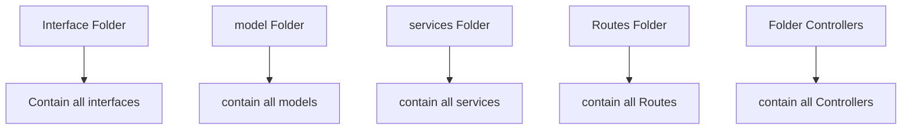
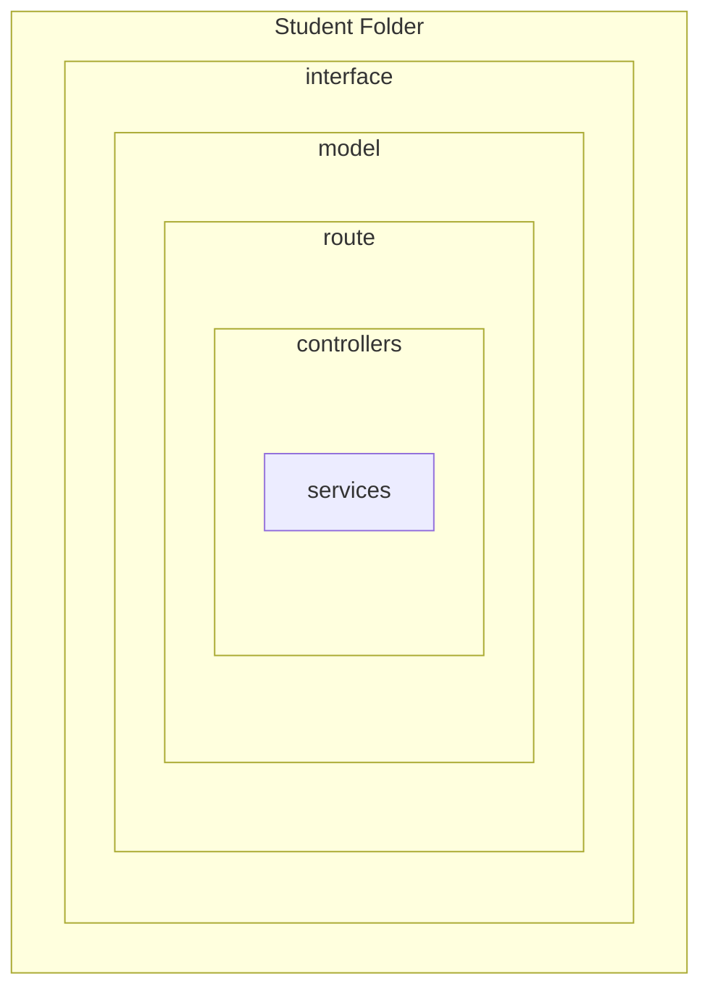
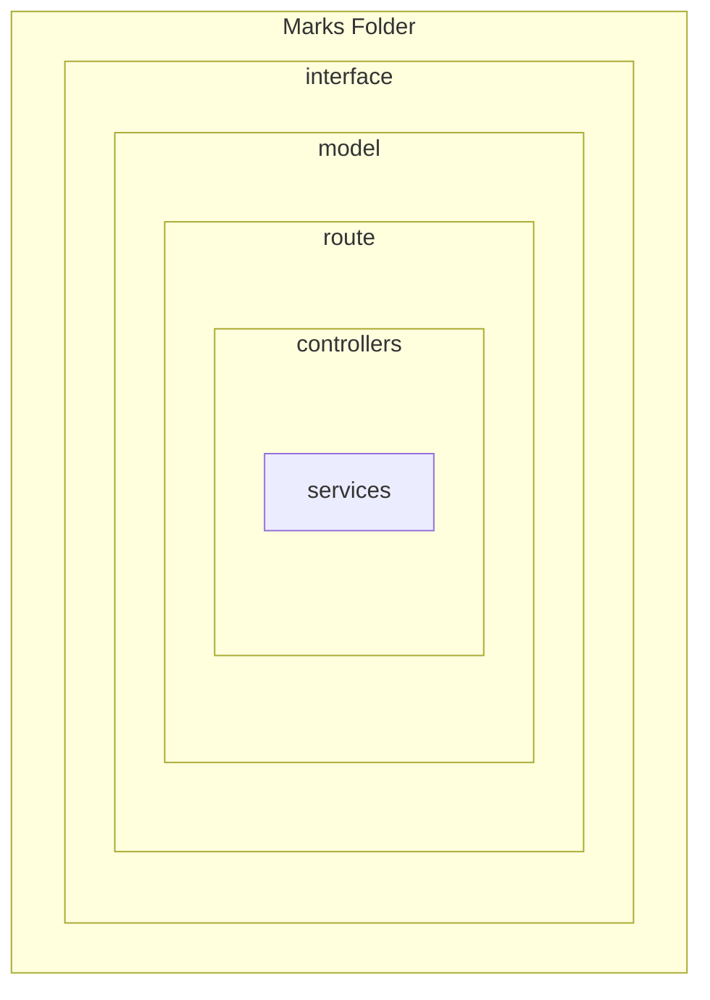
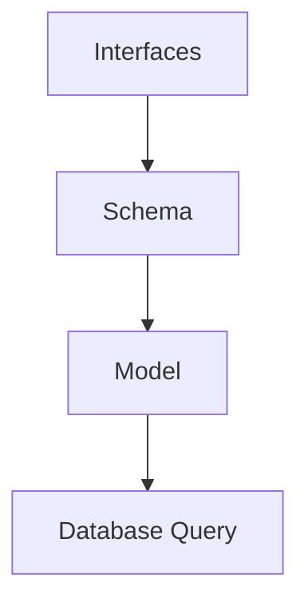

# Mongoose

## What is mongoose ?

-  Mongoose is an Object Data Modeling library for mongodb.

## Why we use mongoose?

-  Schema Definition
-  Model Creation
-  Data validation
-  Querying
-  middleware support
-  population .

## Some Common Package that we need:

-  express
-  typescript
-  cors
-  mongoose
-  dotenv
-  eslint
-  prettier
-  ts-node-dev

## Folder structure:

```$tree/md
    $ Express Js Folder structure
.
├── node_modules
│
├── dist/
├── src/
│   ├── app/
│   ├── app.ts
│   ├── server.ts
│   ├── config/
│           ├─index.ts
├── package.json
├── tsconfig.json
├── .gitignore
├── .env
└── README.md
      ...
```

### Get Current Path:

-  1st way :

```ts
process.cwd();
```

-  2nd way:

```ts
__dirname;
```

## Configure `dotenv` :

-  create :file_folder:`configs` at `src/app/`.
-  create create a `index.ts` file :
-  write codes:

```ts
import dotenv from "dotenv";
import path from "path";

// dotenv setup with process.cwd() :
dotenv.config({ path: path.join(process.cwd() + ".env") });
// console.log(process.cwd() + ".env");

export = {
   port: process.env.PORT,
   database_url: process.env.DATABASE_URI,
};
```

## Install & setup Eslint & Prettier :

-  #### [read this blog](https://blog.logrocket.com/linting-typescript-eslint-prettier)
-  run this command :

```ts
   npm install eslint @typescript-eslint/parser @typescript-eslint/eslint-plugin --save-dev
   // install this packages as dev dependencies:
   // eslint
   // @typescript-eslint/parser
   // @typescript-eslint/eslint-plugin
```

-  ### Initialize Eslint or create Eslint configuration:

   -  it's provide an configuration. `.eslintrc.json` file
   -  run the command :

   ```ts
        npx eslint --init
   ```

   -  ##### Then ans the belows question on terminal step by step :

   ```ts
      How would you like to use ESLint?
      What type of modules does your project use?
      Which framework does your project use?
      Does your project use TypeScript?
      Where does your code run?
      How would you like to define a style for your project?
   ```

   -  create an `.eslintignore` file and `dist` and `node_modules`

   ```eslint
   dist
   node_modules
   ```

   -  ##### Add Two script: `package.json`

   ```json
         "scripts": {
               "lint": "eslint src --ignore-path .eslintignore --ext  .ts",
               "lint:fix": "npx eslint src --fix"
          },
   ```

   -  ##### Add some rules : in `.eslintrc.json`

   ```json
      "rules": {
         "/no-unused-vars": "error",
         "no-unused-expressions": "error",
         "prefer-const": "error",
         "no-undef": "error",
         "no-console": "warn"
      },


   ```

   -  ##### Add Globals

   ```json
    "globals": {
         "process": "readonly"
      }
   ```

   -  ##### Edit extends In `.eslintrc.json` : This helps to save from conflict of prettier and eslint.

   ```json
     "extends": [
    "eslint:recommended",
    "plugin:@typescript-eslint/recommended",
    "prettier"
   ],
   ```

## Install Prettier :

-  ### Installation:
   ```ts
      npm install --save-dev prettier
   ```
-  ### Create `.prettierrc.json` and this file:

   ```json
   {
      "semi": false, // Specify if you want to print semicolons at the end of statements
      "singleQuote": true // If you want to use single quotes
   }
   ```

-  ### Install and `two script` on `package.json` for prettier:
   -  to Format with prettier:
   ```json
      "prettier" : "prettier --ignore-path .gitignore --write \"./src/**/*.+(js|ts|json)\",
      "prettier:fix" : "npx prettier --write src"
   ```
-  ### Install another `eslint-config-prettier` to handle eslint and prettier
   conflict.
   ```ts
      npm install --save-dev eslint-config-prettier
   ```
-  ### Edit extends In `.eslintrc.json` : This helps to save from conflict of prettier and eslint.

   ```json
     "extends": [
    "eslint:recommended",
    "plugin:@typescript-eslint/recommended",
    "prettier"
   ],
   ```

## Install `ts-node-dev` to run `server.ts`:

-  ### install :
   ```ts
      npm i ts-node-dev --save-dev
   ```
-  ### Add an script on `package.json` :

   ```json
      "start:dev": "ts-node-dev --respawn --transpile-only ./src/server.ts"

   ```

## Software Design Pattern

-  There many software design pattern like `mvc` and `modular` pattern
-  ### MVC Pattern :



-  ### Modular Pattern :






## Benefits of Modular Pattern:

1. Scalability
2. Maintainability
3. Better Refactoring
4. Efficient Development

## Follow rules :

-  #### Dry : Don't Repeat Your Code
-  #### FAT Model / Thin Controller

## We follow the rules on our express application :


