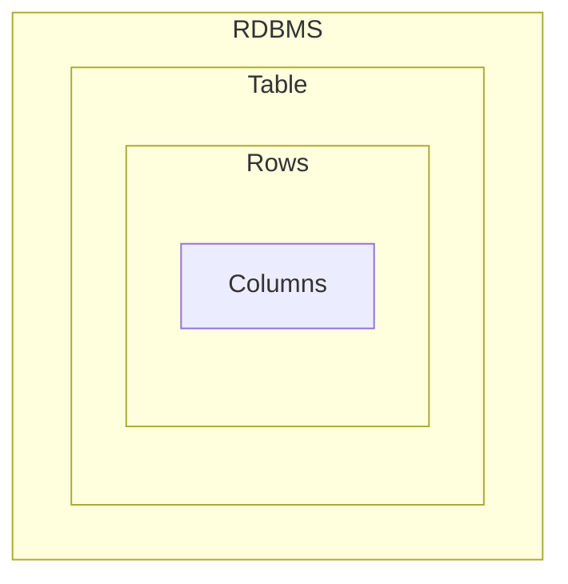
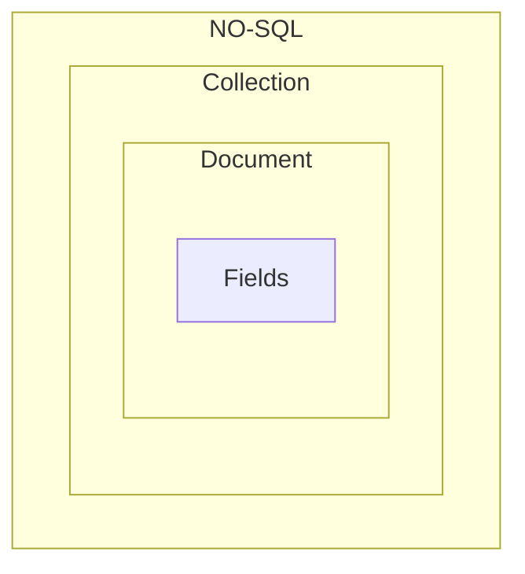

#
 Be a Mongoose Master

## What is mongoDB ?

-  MongoDB is an NO-SQL Database, Which store JSON like documents.
-  Mongo Stores data like `BSON Format`.
-  No-SQL databases break from relational models, ideal for managing vast data.
-  MongoDB stands out for it's `scalability`, `flexibility` and `performance`
   trusted by giants like Facebook , Google, EBay.
-  MongoDB is Developed By `MongoDB Inc`

## Why we use `MongoDB` ?

-  Highly Scalable, High-performance and Open-source.
-  Document Oriented Database
-  Cost Effective Solutions.
-  Rich Ecosystem of Tools, Documents and community.

## What is the different between MongoDB & Relational Database.

|  Features   |                 MongoDB                 | Relational Database |
| :---------: | :-------------------------------------: | :-----------------: |
| Data Model  |            Document Oriented            |     Relational      |
|   Schema    |                Flexible                 |        RigId        |
| Scalability |        Horizontally & Vertically        |     Vertically      |
| Performance | Optimized Structure or UnStructure Data |  On Structured Dat  |

## Main Difference MongDB and Relational Database:

## MongoDB Features:

-  JSON Like Documents (BSON).
-  Indexing
-  Aggregation Framework.
-  Security Features
-  Free Atlas Database
-  MongoDB Compass GUI
