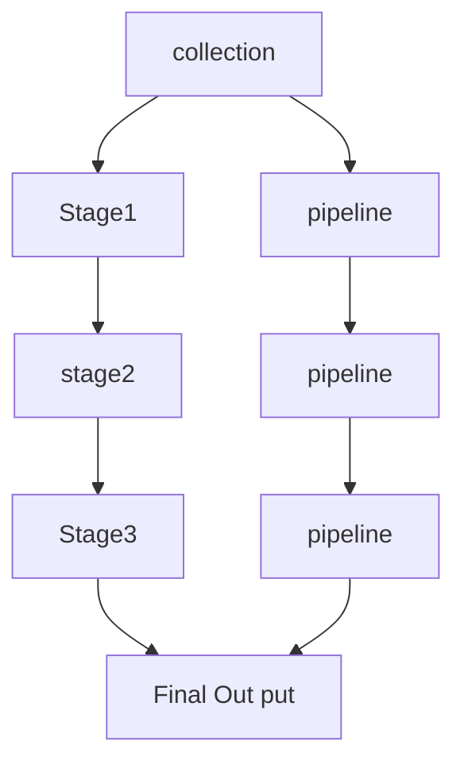

# Learn Aggregation :

## What is Aggregation?

-  Aggregation is a way to process large number of documents in collection by
   means passing through different stages.
-  The stages make up known as pipeline.
-  The Stages in a pipeline can `filter` ,`sort`, `group`, `reshape` & `modify`
   and passing them through pipeline.

## Aggregation `Syntax` :

```js
   db.collection.aggregate([
      // stage one
      {} // : pipeline one
      // stage two
      {} // : pipeline two
      // stage three
      {} // : pipeline three
   ])

```

## Data flow in Aggregation :



## Aggregation Stages or Operators :

-  #### `$match` :

   1. `$match` fields allows us to choose those documents , that we want to work
      with.
   2. we can find or filter
   3. we can pass any query to find out our data in `$match `operator
   4. syntax:

   ```js
   db.collection.aggregate([
      //match stage :
      { $match: query },
   ]);
   ```

   5. Example :

   ```js
   db.test.aggregate([
      // stage1 :
      {
         $match: {
            age: { $lte: 50 },
            skills: { $elemMatch: { name: "JAVASCRIPT", level: "Expert" } },
         },
      },
   ]);
   ```

-  #### `$project` : project stage works for project or selection properties which we need.

   -  Here we used 1 or 0 to select or deselect properties.
   -  syntax :

   ```js
   db.collection.aggregate([
      // match stage:
      // project stage :
      { $project: { propertyName: 1, propertyName: 1 } },
   ]);
   ```

   -  Example :

   ```ts
   db.test.aggregate([
      //stage :
      {
         $match: {
            age: { $lt: 70 },
            skills: { $elemMatch: { name: "C#", level: "Intermidiate" } },
         },
      },
      //stage:
      { $project: { age: 1, skills: 1 } },
      //stage :
      {
         $addFields: {
            course: "Next Level Web Development",
            organization: "Programming Hero",
         },
      },
      // {$out: "level-2"},
      { $merge: "test" },
   ]);
   ```

   -  `Rename` fields in Project:

      -  syntax:

      ```ts
      {
         $project: {
            newPropertyName: "$fieldName";
         }
      }
      ```

      -  Example:

      ```ts
         {

            $project: {
                  totalSalary: 1,
                  minSalary: 1,
                  maxSalary: 1,
                  averageSalary: "$avgSalary", // rename the fields
                  minMaxSalaryRange : {$subtract: ["$maxSalary","$minSalary"]}, // subtract in project

            }
         }

      ```

-  #### `$addFields` : Adds new fields to documents.

   -  But not modify the existing documents :
   -  syntax:

   ```js
   db.collection.aggregate([
      // match stage :
      { $match: { age: { $lte: 20 } } },
      // addFields stage :
      { $addFields: { newPropertyName: value, newPropertyName: value } },
   ]);
   ```

   -  Example :

   ```ts
   db.test.aggregate([
      //stage :
      {
         $match: {
            age: { $lt: 70 },
            skills: { $elemMatch: { name: "C#", level: "Intermidiate" } },
         },
      },
      //stage:
      { $project: { age: 1, skills: 1 } },
      //stage :
      {
         $addFields: {
            course: "Next Level Web Development",
            organization: "Programming Hero",
         },
      },
      // {$out: "level-2"},
      { $merge: "test" },
   ]);
   ```

   -  Output:

   ```json
   [
      // every documents looks like :
      {
         "age": 1,
         "skills": [
            {
               "name": "JAVASCRIPT",
               "level": "Intermediate",
               "isLearning": false
            },
            {
               "name": "C#",
               "level": "Intermediate",
               "isLearning": false
            },
            {
               "name": "C",
               "level": "Intermediate",
               "isLearning": false
            }
         ],
         "course": "Next Level Web Development",
         "organization": "Programming Hero"
      },
      {
         "age": 1,
         "skills": [
            {
               "name": "JAVASCRIPT",
               "level": "Intermediate",
               "isLearning": false
            },
            {
               "name": "C#",
               "level": "Intermediate",
               "isLearning": false
            },
            {
               "name": "C",
               "level": "Intermediate",
               "isLearning": false
            }
         ],
         "course": "Next Level Web Development",
         "organization": "Programming Hero"
      }
   ]
   ```

-  #### `$out` : create a `new collection` with `previous stage` `documents`.

   -  syntax:

   ```ts
   db.collection.aggregate([
      // merge Stage :
      // others stage :
      // out stage :
      { $out: "new collection name" },
   ]);
   ```

   -  Example :

   ```ts
   db.test.aggregate([
      //stage :
      {
         $match: {
            age: { $lt: 70 },
            skills: { $elemMatch: { name: "C#", level: "Intermidiate" } },
         },
      },
      //stage:
      { $project: { age: 1, skills: 1 } },
      //stage :
      {
         $addFields: {
            course: "Next Level Web Development",
            organization: "Programming Hero",
         },
      },
      { $out: "level-2" },
   ]);
   ```

-  #### `$merge` stage : Merge the `previous stage ` documents with `an existing collection`

   -  merge stage can modify existing collections
   -  syntax :

   ```ts
   db.collection.aggregate([
      // match stage :
      // others stage :
      // merge stage :
      { $merge: "existing  collection" },
   ]);
   ```

   -  Example:

   ```ts
   db.test.aggregate([
      //stage :
      {
         $match: {
            age: { $lt: 70 },
            skills: { $elemMatch: { name: "C#", level: "Intermidiate" } },
         },
      },
      //stage:
      { $project: { age: 1, skills: 1 } },
      //stage :
      {
         $addFields: {
            course: "Next Level Web Development",
            organization: "Programming Hero",
         },
      },
      { $merge: "test" },
   ]);
   ```

-  ### `$group` stage operators:

   -  In group stage we can group data with any specific `fields`
   -  In Group stage we must provide an `_id` and it's value will `null` or
      `$fieldName`.
   -  If we provide `null` , in group we found all documents from collection.

   ```js
   db.collection.aggregate([
      // get all data:
      {
         $group: { _id: null, total: { $sum: 1 } },
      },
      // sum : 1 means calculate documents number in collection.
   ]);
   ```

   -  If we provide `$fieldName` the data will be groupe.

   ```js
   db.collection.aggregate([
      // create group with $gender fields:
      // sum : "$salary" calculate the the total salary by adding every document salary
      {
         $group: { _id: "$gender", total: { $sum: "$salary" } },
      },
   ]);
   ```

   -  Here we can `count`, `sum`, `average`, `find maximum`,
      `find minimum `and` push` data on array.
   -  For complete `$group` operation we can use `$count`, `$sum`, `$min`,
      `$max`, `$avg` and `$push`
   -  Example :

   ```ts
   db.test.aggregate([
      // stage -> 1:
      {
         $group: {
            _id: null,
            totalSalary: { $sum: "$salary" },
            minSalary: { $min: "$salary" },
            maxSalary: { $max: "$salary" },
            avgSalary: { $avg: "$salary" },
            data: { $push: "$$ROOT" },
         },
      },

      // stage -> 2:
      {
         $project: {
            totalSalary: 1,
            minSalary: 1,
            maxSalary: 1,
            averageSalary: "$avgSalary", // rename the fields
            minMaxSalaryRange: { $subtract: ["$maxSalary", "$minSalary"] }, // substract in project
         },
      },
   ]);
   ```

-  #### `$unwind`: `$unwind` method helps us to separate every `array` elements.

   -  and `reuse` the array element for every documents:
   -  syntax:

   ```ts
   {
      $unwind: "$arrayFieldName";
   }
   ```

   -  Suppose we have an documents like this:

   ```json
         [
           {
               "_id" : ObjectId("65534b7c6f0724dab1759586"),
               "friends" : [ "Rakib", "Ratul", "Roman" ]
            }
         ]
   ```

   -  After using `$unwind` method: the documents separated for every array item
      but others data can't change.

   ```ts
      /* 1 createdAt:11/14/2023, 4:27:08 PM*/
         {
            "_id" : ObjectId("65534b7c6f0724dab1759586"),
            "friends" : "Rakib"
         },

         /* 2 createdAt:11/14/2023, 4:27:08 PM*/
         {
            "_id" : ObjectId("65534b7c6f0724dab1759586"),
            "friends" : "Ratul"
         },

         /* 3 createdAt:11/14/2023, 4:27:08 PM*/
         {
            "_id" : ObjectId("65534b7c6f0724dab1759586"),
            "friends" : "Roman"
         }
   ```

   -  Example:

   ```ts
   db.test.aggregate([
      // stage -> 1:
      { $unwind: "$friends" },
      // stage -> 2:
      { $unwind: "$interests" },
      // stage -> 3:
      {
         $group: {
            _id: "$age",
            agePerFriends: { $push: "$friends" },
            agePerInterests: { $push: "$interests" },
         },
      },
   ]);
   ```
