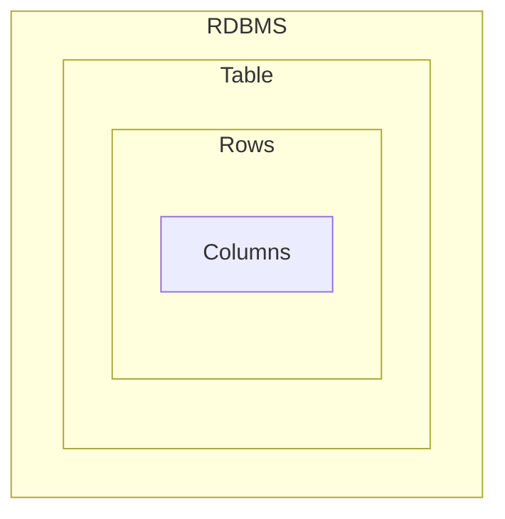
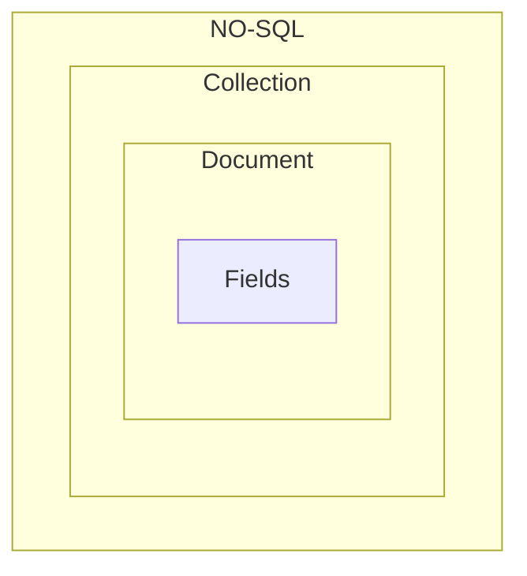

#<p style="color: #f00; text-align: center;"> Be a Mongoose Master</p>

## What is mongoDB ?

-  MongoDB is an NO-SQL Database, Which store JSON like documents.
-  Mongo Stores data like `BSON Format`.
-  No-SQL databases break from relational models, ideal for managing vast data.
-  MongoDB stands out for it's `scalability`, `flexibility` and `performance`
   trusted by giants like Facebook , Google, EBay.
-  MongoDB is Developed By `MongoDB Inc`

## Why we use `MongoDB` ?

-  Highly Scalable, High-performance and Open-source.
-  Document Oriented Database
-  Cost Effective Solutions.
-  Rich Ecosystem of Tools, Documents and community.

## What is the different between MongoDB & Relational Database.

|  Features   |                 MongoDB                 | Relational Database |
| :---------: | :-------------------------------------: | :-----------------: |
| Data Model  |            Document Oriented            |     Relational      |
|   Schema    |                Flexible                 |        RigId        |
| Scalability |        Horizontally & Vertically        |     Vertically      |
| Performance | Optimized Structure or UnStructure Data |  On Structured Dat  |

## Main Difference MongDB and Relational Database:





## MongoDB Features:

-  JSON Like Documents (BSON).
-  Indexing
-  Aggregation Framework.
-  Security Features
-  Free Atlas Database
-  MongoDB Compass GUI

## Setup MongoDB in Computer :

-  Download MongoDB for windows.
-  Install mongodb for windows
-  When we install mongoDB with `Mongo Compass` automatically installed.
-  ##### `MongoDB Shell` :
   -  Download mongoDB shell msi version
   -  install It.
   -  Then go your local drive. My local drive is `C drive`.
   -  Copy this bin folder path:
   ```js
      C:\Program Files\MongoDB\Server\7.0\bin
   ```
   -  Search on window : for `Environment Variable` and setup `then click ` on
      path.
   -  Add a new path
   -  the save it.
-  ##### Use mongo shell or `mongosh `:
   -  run this command to check `mongosh version`:
   ```js
      mongod --version
   ```
   -  to use `mongoDB shell` on `CMD` the command :
   ```js
   mongosh;
   ```
   -  the run any command of mongodb to access database.

# MongoDB Shell `Function` & `Operation` :

|               Function               |          for use           |            example            |
| :----------------------------------: | :------------------------: | :---------------------------: |
|             ` show dbs`              |     show all database      |          `show dbs`           |
|            `use database`            |    create new or switch    |     `use newDatabaseName`     |
|    `db.createCollection("name")`     |   create new collection    | `db.createCollection('test')` |
| `db.getCollection("collectionName")` |       get Collection       |  `db.getCollection('test')`   |
|         `db.collectionName`          | get Collection another way |      `db.collectionName`      |
